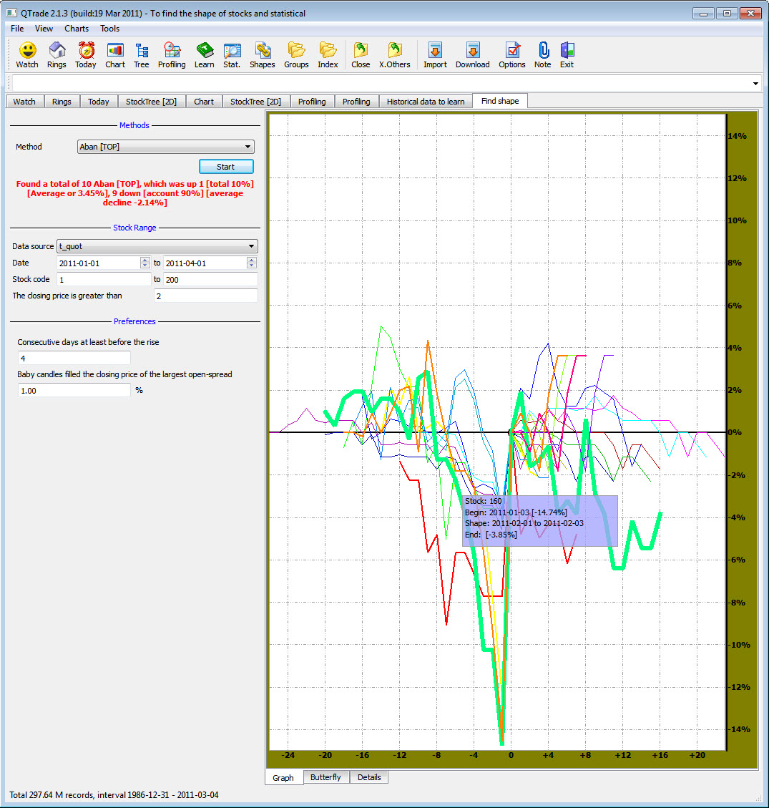

# QTrade
To find the shape of stocks and statistical (使用QT开发的，基于股市数据进行图形分析预测的系统)

## 主要功能
1. 自动下载更新股市数据
2. 各种图形（烛图、各种股市数据图形，分析图形）
3. 各种自创的股市数据分析图形，图形可以活动，形象的展示股市趋势
4. 部分图形支持3D
5. 强大的自定义功能
6. 基于各种数据模型，基于历史数据对股票涨势进行预测和回测

## 软件截图

## 联系我
如果您有任何需要或者疑问，请与我联系：QQ(81224865)，电子邮件(tiger.hu.liu@gmail.com)